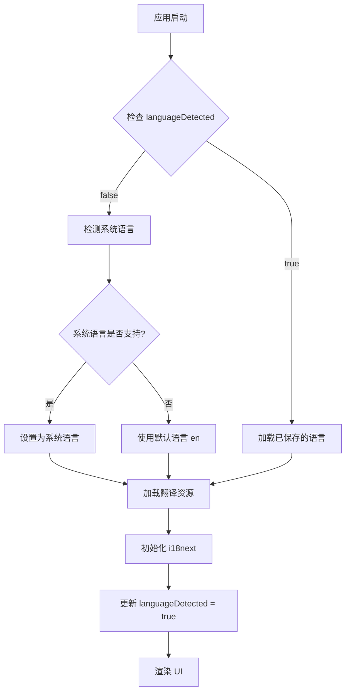
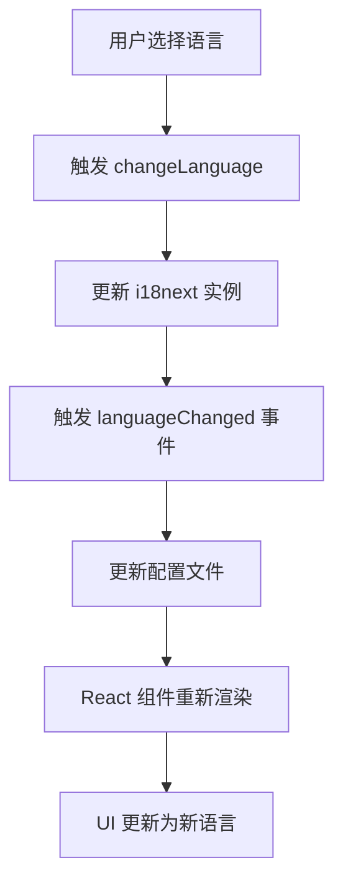

# 数据模型：多语言支持 / Data Model: Multi-Language Support

**日期 / Date**: 2026-01-05
**目的 / Purpose**: 定义多语言功能的数据结构和实体关系 / Define data structures and entity relationships for i18n feature

## 核心实体 / Core Entities

### 1. 语言配置 / Language Configuration

**中文说明**：存储用户的语言偏好设置，作为应用配置的一部分持久化。

**English**: Stores user's language preference settings, persisted as part of application configuration.

**位置 / Location**: 扩展现有的 `config.ts` / Extends existing `config.ts`

**结构 / Structure**:

```typescript
interface LanguageConfig {
  /**
   * 用户选择的显示语言 / User's selected display language
   *
   * @中文 当前语言代码（如 "en"、"zh-CN"）
   * @English Current language code (e.g., "en", "zh-CN")
   */
  currentLanguage: string;

  /**
   * 可用语言列表 / Available languages list
   *
   * @中文 系统支持的所有语言
   * @English All languages supported by the system
   */
  availableLanguages: readonly LanguageInfo[];

  /**
   * 是否已完成首次语言检测 / Whether first-time language detection is complete
   *
   * @中文 用于判断是否需要执行系统语言自动检测
   * @English Used to determine if system language auto-detection is needed
   */
  languageDetected: boolean;
}

interface LanguageInfo {
  /**
   * 语言代码 / Language code
   * @中文 符合 BCP 47 标准（如 "en"、"zh-CN"）
   * @English Follows BCP 47 standard (e.g., "en", "zh-CN")
   */
  code: string;

  /**
   * 语言的本地化名称 / Localized name of the language
   * @中文 用该语言自身显示的名称（如 "English"、"简体中文"）
   * @English Name displayed in the language itself (e.g., "English", "简体中文")
   */
  nativeName: string;

  /**
   * 是否为默认语言 / Whether this is the default language
   */
  isDefault: boolean;
}
```

**默认值 / Default Values**:

```typescript
const DEFAULT_LANGUAGE_CONFIG: LanguageConfig = {
  currentLanguage: 'en',
  availableLanguages: [
    { code: 'en', nativeName: 'English', isDefault: true },
    { code: 'zh-CN', nativeName: '简体中文', isDefault: false }
  ],
  languageDetected: false
};
```

---

### 2. 翻译资源 / Translation Resources

**中文说明**：包含所有 UI 文本的翻译键值对。每种语言一个 JSON 文件。

**English**: Contains all UI text translation key-value pairs. One JSON file per language.

**位置 / Location**: `src/i18n/locales/`

**结构 / Structure**:

```typescript
/**
 * 翻译资源类型 / Translation resource type
 *
 * @中文 嵌套对象结构，支持命名空间组织
 * @English Nested object structure, supports namespace organization
 */
type TranslationResource = {
  [namespace: string]: {
    [key: string]: string | TranslationResource;
  };
};
```

**示例 / Example** (`src/i18n/locales/en.json`):

```json
{
  "common": {
    "ok": "OK",
    "cancel": "Cancel",
    "save": "Save",
    "delete": "Delete",
    "close": "Close"
  },
  "settings": {
    "title": "Settings",
    "language": {
      "label": "Display Language",
      "description": "Choose your preferred language"
    },
    "theme": {
      "label": "Theme",
      "dark": "Dark",
      "light": "Light"
    }
  },
  "torrent": {
    "table": {
      "name": "Name",
      "size": "Size",
      "status": "Status",
      "progress": "Progress",
      "speed": "Speed"
    },
    "status": {
      "downloading": "Downloading",
      "seeding": "Seeding",
      "paused": "Paused",
      "error": "Error"
    }
  }
}
```

**示例 / Example** (`src/i18n/locales/zh-CN.json`):

```json
{
  "common": {
    "ok": "确定",
    "cancel": "取消",
    "save": "保存",
    "delete": "删除",
    "close": "关闭"
  },
  "settings": {
    "title": "设置",
    "language": {
      "label": "显示语言",
      "description": "选择您偏好的语言"
    },
    "theme": {
      "label": "主题",
      "dark": "深色",
      "light": "浅色"
    }
  },
  "torrent": {
    "table": {
      "name": "名称",
      "size": "大小",
      "status": "状态",
      "progress": "进度",
      "speed": "速度"
    },
    "status": {
      "downloading": "下载中",
      "seeding": "做种中",
      "paused": "已暂停",
      "error": "错误"
    }
  }
}
```

---

### 3. i18n 实例配置 / i18n Instance Configuration

**中文说明**：react-i18next 的初始化配置和实例管理。

**English**: Initialization configuration and instance management for react-i18next.

**位置 / Location**: `src/i18n/index.ts`

**结构 / Structure**:

```typescript
import i18n from 'i18next';
import { initReactI18next } from 'react-i18next';
import type { Resource } from 'i18next';

/**
 * i18n 初始化选项 / i18n initialization options
 */
interface I18nInitOptions {
  /**
   * 默认语言 / Default language
   */
  defaultLanguage: string;

  /**
   * 回退语言 / Fallback language
   * @中文 当翻译键缺失时使用
   * @English Used when translation key is missing
   */
  fallbackLanguage: string;

  /**
   * 翻译资源 / Translation resources
   */
  resources: Resource;

  /**
   * 是否在开发模式下启用调试 / Enable debug in development mode
   */
  debug: boolean;
}

/**
 * i18n 配置 / i18n configuration
 */
const i18nConfig: I18nInitOptions = {
  defaultLanguage: 'en',
  fallbackLanguage: 'en',
  resources: {
    en: {
      translation: enTranslations
    },
    'zh-CN': {
      translation: zhCNTranslations
    }
  },
  debug: process.env.NODE_ENV === 'development'
};
```

---

### 4. 语言切换事件 / Language Change Event

**中文说明**：语言切换时触发的事件和回调机制。

**English**: Event and callback mechanism triggered when language changes.

**结构 / Structure**:

```typescript
/**
 * 语言切换事件数据 / Language change event data
 */
interface LanguageChangeEvent {
  /**
   * 之前的语言 / Previous language
   */
  previousLanguage: string;

  /**
   * 新的语言 / New language
   */
  newLanguage: string;

  /**
   * 切换时间戳 / Change timestamp
   */
  timestamp: number;
}

/**
 * 语言切换回调 / Language change callback
 */
type LanguageChangeCallback = (event: LanguageChangeEvent) => void;
```

---

## 数据流 / Data Flow

### 语言初始化流程 / Language Initialization Flow

**中文**：



**English**:

```
App Start → Check languageDetected
  ├─ If false → Detect system language
  │   ├─ If supported → Set to system language
  │   └─ If not → Use default (en)
  └─ If true → Load saved language
       ↓
Load translation resources → Initialize i18next → Update languageDetected → Render UI
```

### 语言切换流程 / Language Switch Flow

**中文**：



**English**:

```
User selects language → Trigger changeLanguage → Update i18next instance
  ↓
Trigger languageChanged event → Update config file → React components re-render
  ↓
UI updates to new language
```

---

## 状态管理 / State Management

**中文说明**：语言状态通过 React Context 或现有的配置管理机制共享。

**English**: Language state is shared via React Context or existing config management mechanism.

```typescript
/**
 * i18n Context / i18n 上下文
 */
interface I18nContextValue {
  /**
   * 当前语言 / Current language
   */
  currentLanguage: string;

  /**
   * 切换语言函数 / Change language function
   */
  changeLanguage: (language: string) => Promise<void>;

  /**
   * 可用语言列表 / Available languages
   */
  availableLanguages: readonly LanguageInfo[];

  /**
   * i18n 是否已就绪 / Whether i18n is ready
   */
  isReady: boolean;
}
```

---

## 验证规则 / Validation Rules

### 语言代码验证 / Language Code Validation

**中文**：
- 必须符合 BCP 47 标准
- 必须在 `availableLanguages` 列表中
- 不能为空字符串

**English**:
- Must conform to BCP 47 standard
- Must be in `availableLanguages` list
- Cannot be empty string

```typescript
function isValidLanguageCode(code: string): boolean {
  const BCP47_REGEX = /^[a-z]{2,3}(-[A-Z]{2})?$/;
  return BCP47_REGEX.test(code) &&
         DEFAULT_LANGUAGE_CONFIG.availableLanguages.some(lang => lang.code === code);
}
```

### 翻译键验证 / Translation Key Validation

**中文**：
- 翻译键必须存在于英文资源文件中
- 所有语言的翻译键必须保持一致
- 键名使用点号分隔的命名空间（如 `settings.language.label`）

**English**:
- Translation keys must exist in English resource file
- All languages must have consistent translation keys
- Key names use dot-separated namespaces (e.g., `settings.language.label`)

---

## 性能考虑 / Performance Considerations

### 翻译资源加载 / Translation Resource Loading

**中文**：
- **预加载**：在应用启动时加载所有翻译资源（文件较小，~30-50KB 总计）
- **缓存**：i18next 自动缓存已加载的翻译
- **懒加载**：不需要（仅 2 种语言，资源文件小）

**English**:
- **Preloading**: Load all translation resources at app startup (files are small, ~30-50KB total)
- **Caching**: i18next automatically caches loaded translations
- **Lazy loading**: Not needed (only 2 languages, small resource files)

### 语言切换性能 / Language Switch Performance

**中文**：
- **目标**：< 500ms
- **机制**：
  - i18next 同步切换语言（已加载的资源）
  - React suspense 处理组件重新渲染
  - 避免全页刷新

**English**:
- **Target**: < 500ms
- **Mechanism**:
  - i18next switches language synchronously (pre-loaded resources)
  - React suspense handles component re-renders
  - Avoid full page refresh

---

## 扩展性 / Extensibility

### 添加新语言 / Adding New Languages

**中文**：要添加新语言（如日语）：

1. 创建 `src/i18n/locales/ja.json`
2. 更新 `DEFAULT_LANGUAGE_CONFIG.availableLanguages`
3. 在 `src/i18n/index.ts` 中导入新的翻译资源
4. 运行覆盖率脚本验证键完整性

**English**: To add a new language (e.g., Japanese):

1. Create `src/i18n/locales/ja.json`
2. Update `DEFAULT_LANGUAGE_CONFIG.availableLanguages`
3. Import new translation resource in `src/i18n/index.ts`
4. Run coverage script to validate key completeness

---

## 数据持久化 / Data Persistence

**中文**：

**存储位置**：
- **原生应用**：应用配置文件（JSON），由 Tauri 管理
- **Web 模式**：localStorage 或 Transmission 的 Web 配置存储

**存储键**：`language` (作为配置对象的一部分)

**English**:

**Storage Location**:
- **Native app**: Application config file (JSON), managed by Tauri
- **Web mode**: localStorage or Transmission's web config storage

**Storage Key**: `language` (as part of config object)

```typescript
// 保存语言配置 / Save language config
function saveLanguageConfig(config: LanguageConfig): void {
  // 与现有 config.ts 集成
  // Integrate with existing config.ts
  updateConfig({ language: config });
}

// 加载语言配置 / Load language config
function loadLanguageConfig(): LanguageConfig {
  const config = loadConfig();
  return config.language || DEFAULT_LANGUAGE_CONFIG;
}
```

---

## 类型安全 / Type Safety

**中文**：从 `en.json` 生成 TypeScript 类型，确保翻译键的类型安全。

**English**: Generate TypeScript types from `en.json` to ensure type-safe translation keys.

```typescript
/**
 * 自动生成的翻译键类型 / Auto-generated translation key types
 *
 * @中文 从 en.json 生成
 * @English Generated from en.json
 */
type TranslationKeys =
  | 'common.ok'
  | 'common.cancel'
  | 'settings.title'
  | 'settings.language.label'
  | 'torrent.table.name'
  // ... 所有其他键 / ... all other keys
  ;

/**
 * 类型安全的翻译函数 / Type-safe translation function
 */
function t(key: TranslationKeys, params?: Record<string, unknown>): string {
  return i18n.t(key, params);
}
```

---

## 数据模型总结 / Data Model Summary

| 实体 / Entity | 位置 / Location | 用途 / Purpose |
|---|---|---|
| `LanguageConfig` | `config.ts` | 存储用户语言偏好 / Store user language preference |
| `TranslationResource` | `src/i18n/locales/*.json` | 包含所有 UI 翻译 / Contains all UI translations |
| `I18nInitOptions` | `src/i18n/index.ts` | i18next 初始化配置 / i18next initialization config |
| `LanguageChangeEvent` | `src/i18n/types.ts` | 语言切换事件数据 / Language change event data |
| `I18nContextValue` | `src/i18n/context.tsx` | React 上下文值 / React context value |

**中文**：数据模型设计遵循简单性和类型安全原则，与现有配置管理机制集成，支持未来扩展。

**English**: Data model design follows simplicity and type safety principles, integrates with existing config management, and supports future extensions.
